autoscale:true
slidenumbers: true
footer: 掌数 AI 研发

## 知料是什么

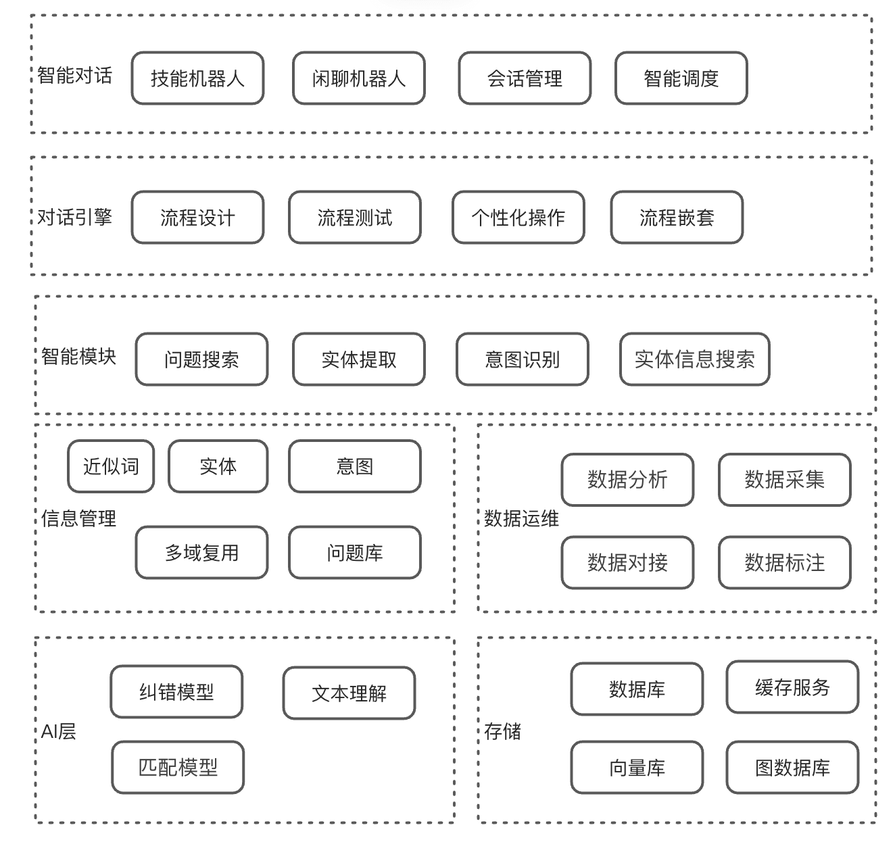

核心功能：

-   智能对话
-   数据搜索

基于知料开发相关应用：

-   智能客服
-   智能外呼

### 基础概念

-   域：用于管理不同领域的数据，针对不同领域提供相关的服务。实现基础领域数据的公用和各业务领域数据的相关隔离。建议不同的维护人员使用不同的域。
    -   回应：针对某个意图，或者某种情况下固定的回复。不同流程，同样回复的公共数据。
    -   问题：业务领域相关的问题集，使用问题集可实现简单的一问一答和搜索功能。
    -   实体：系统业务相关的实体信息和对应的实体关系。
-   话术引擎：针对一定的业务场景，使用系统提供的可视化工具设计对应的对话处理流程。
    -   会话：一次对话流程的执行，从开始到结束。
    -   槽位：会话当中表示当前的所处情况的一些变量。会根据会话的执行不断变化。
    -   意图：在对话过程中，描述所表示的客户意向分类。

### 意图配置

-   根据流程需要，需要配置相关的意图。
-   注意短文本尽量配置到 正则表达式，长文本尽量配置到标准话术。
-   意图路径，表示意图的上下级关系。在流程中 识别到下级意图也属于上级意图的范畴内。
-   高度相似的文本，无需重复配置。（例如 你好 和 你好啊 配置一个即可）

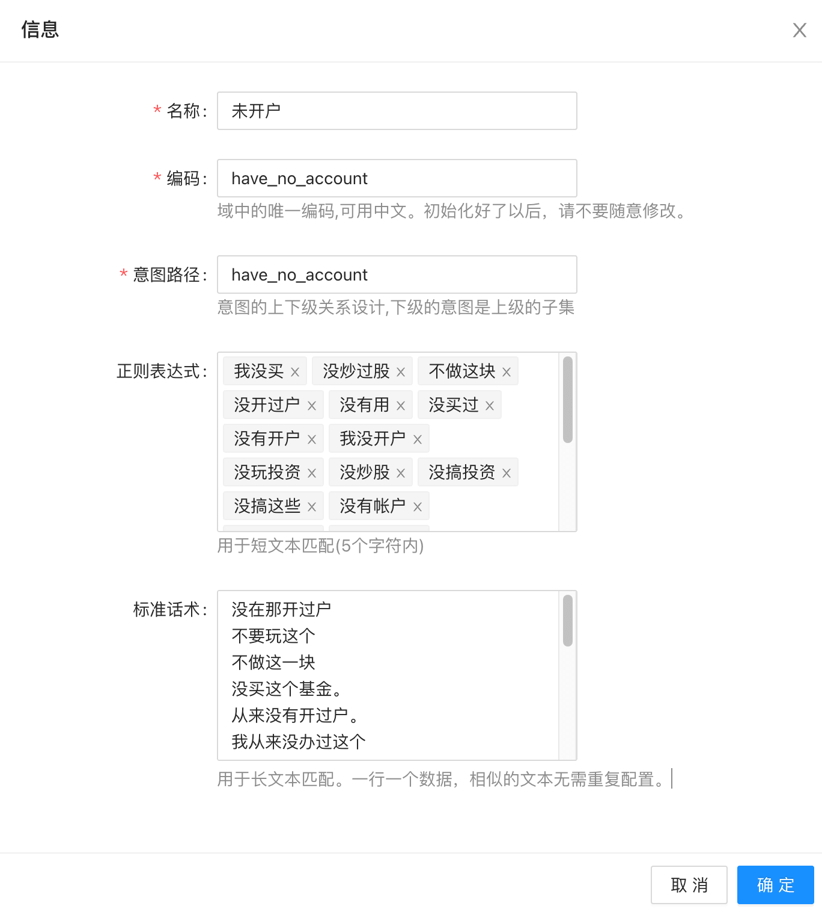

### 回应配置

回应主要是对回复的复用。
不使用回应，可以在每个流程配置对应的回复信息。


#### 回应-按钮配置

1. payload：按键对应的回复指令，
2. /setslot{"templates":"t"}: 表示设置 意图为**setslot**，修改槽位 **templates** 数值为 **t**。


### 问题库配置

问题库/操作/修改 进行编辑
内部问题库，不会出现在热门统计中。（避免出现在智能提示中，如果有占位符问题请配置成内部）
个性化配置，只有问题包含特定字段才需要配置。

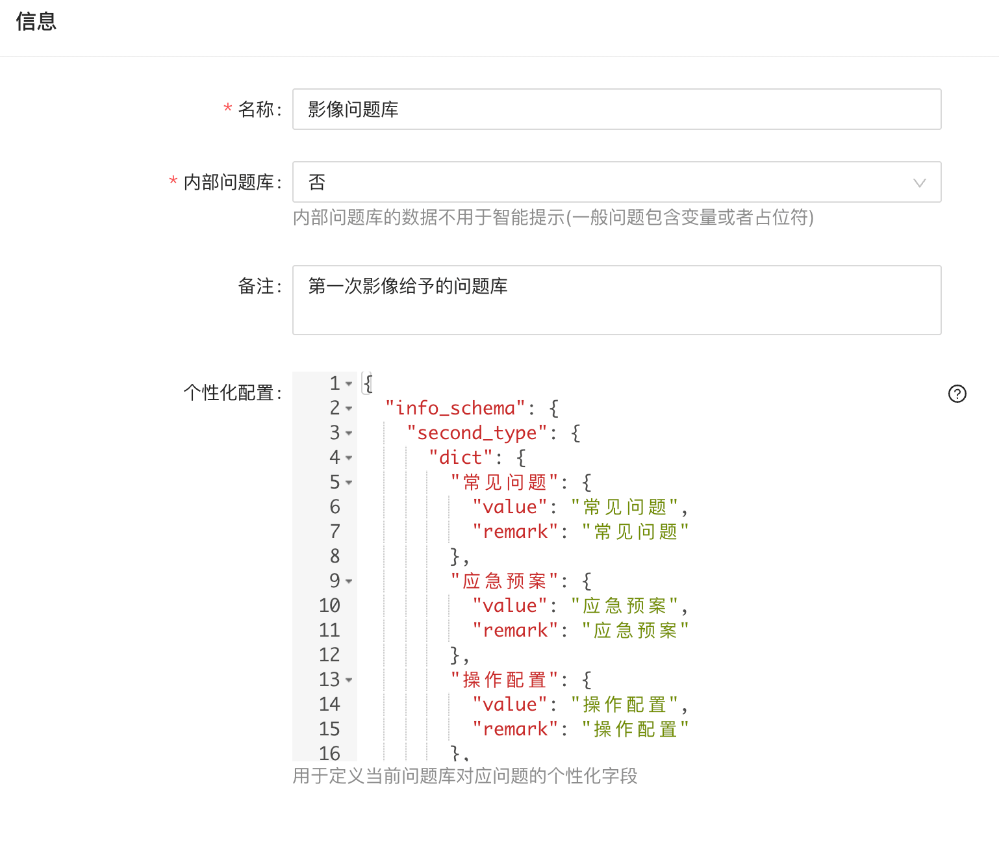

#### 问题信息

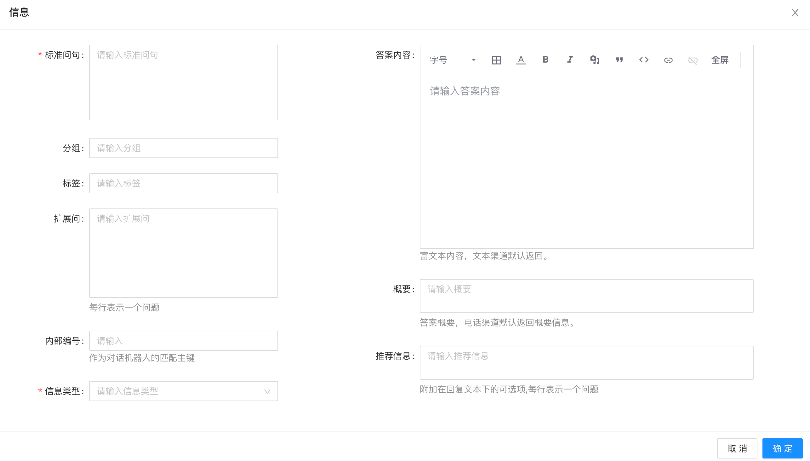

#### 列表直接修改

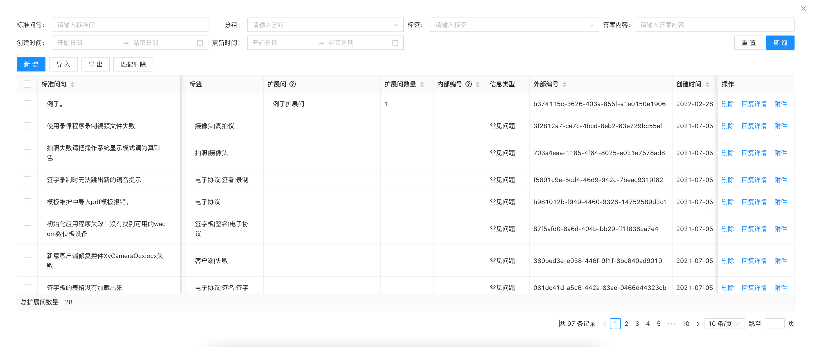

^ 可以在界面中直接修改，除了回复信息需要单独界面修改。

## 构建流程

1. 流程设计
2. 数据补充
3. 测试调整

### 组成部分


-   流程
    -   主流程：具体的业务逻辑
    -   全局流程：非业务场景下的特殊意图处理
    -   子流程：公共业务逻辑的复用
-   节点（普通节点、开始节点、结束节点、主节点、流程节点）
    -   每个节点下支持配置**操作**内容。
-   连接线（**意图**判断，**槽位**判断）
    -   优先级
    -   多个条件（或的关系）

### 流程配置

匹配问题、相关问题库、关键信息 一般不使用。

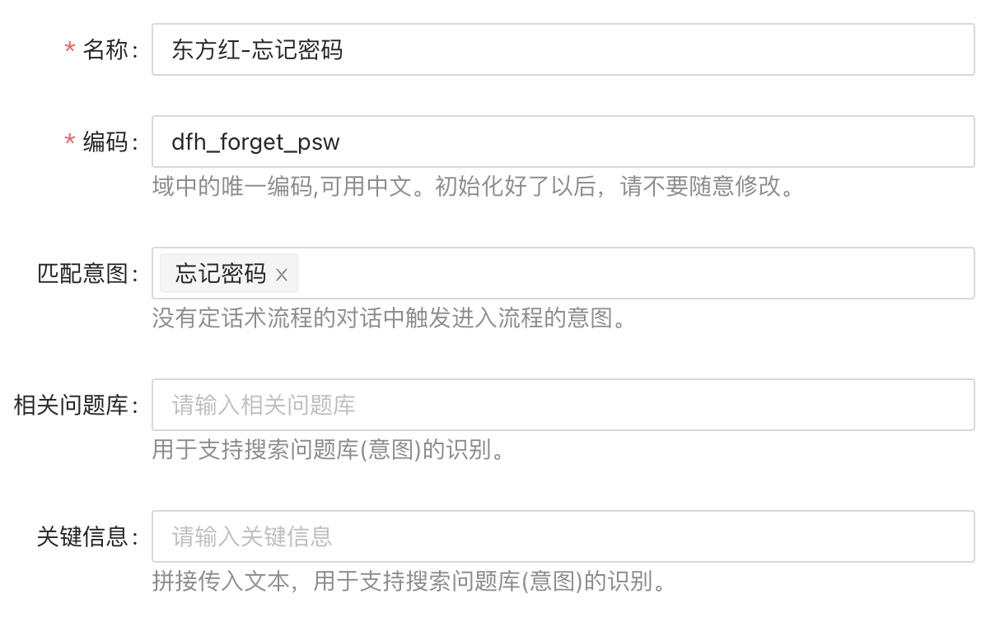

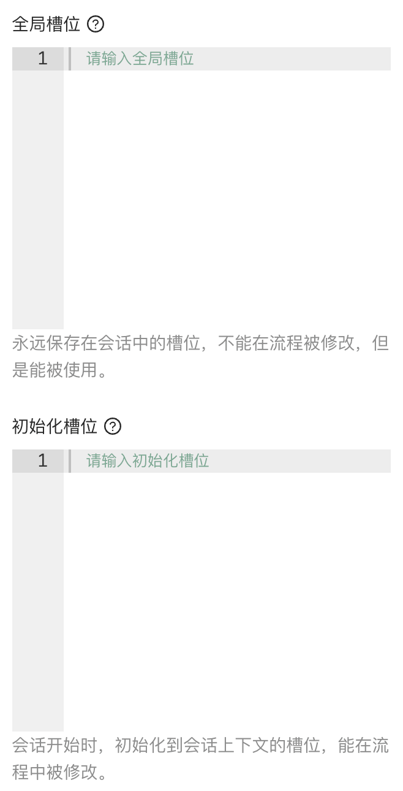

#### 初始化槽位配置

表示初始化一个 **market** 的字符串槽位，初始化数值为 shanghai 。

```json
{
    "market": {
        "value": "shanghai",
        "name": "市场",
        "type": "str",
        "remark": "业务逻辑所用市场"
    }
}
```

### 连线配置

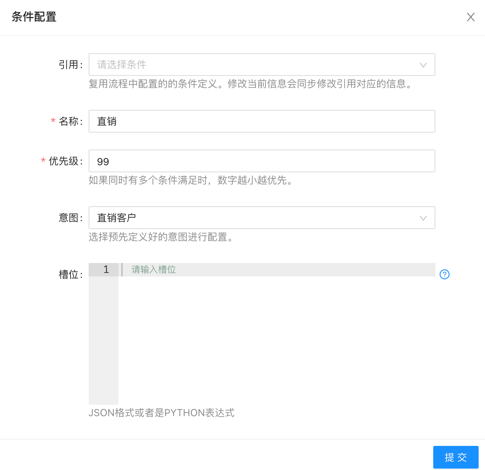

引用：已定义条件的复用。

优先级：条件同时满足下，判断哪个条件更优先。

配置内容：意图或者槽位

表达式支持：
{"a":1} 或者 a==1

### 节点配置

配置多个操作，按照配置的顺序进行执行。

类型：

-   普通节点：默认
-   主干节点：主要是为了在全局回到主干的时候，能够正常路由到对应的节点。
-   流程节点：配置相关子流程，达到流程的复用。


#### 操作提供对应的参数说明

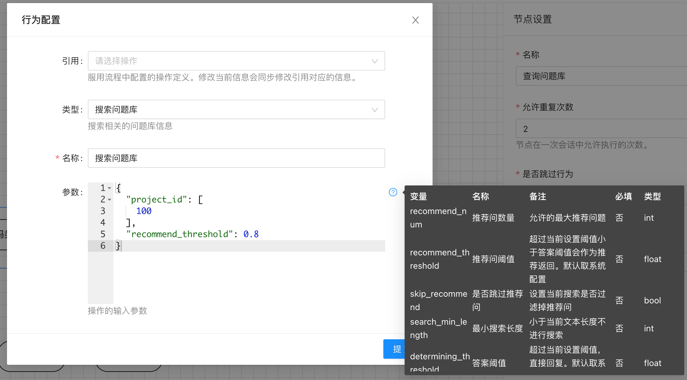

#### 参数配置的智能提醒

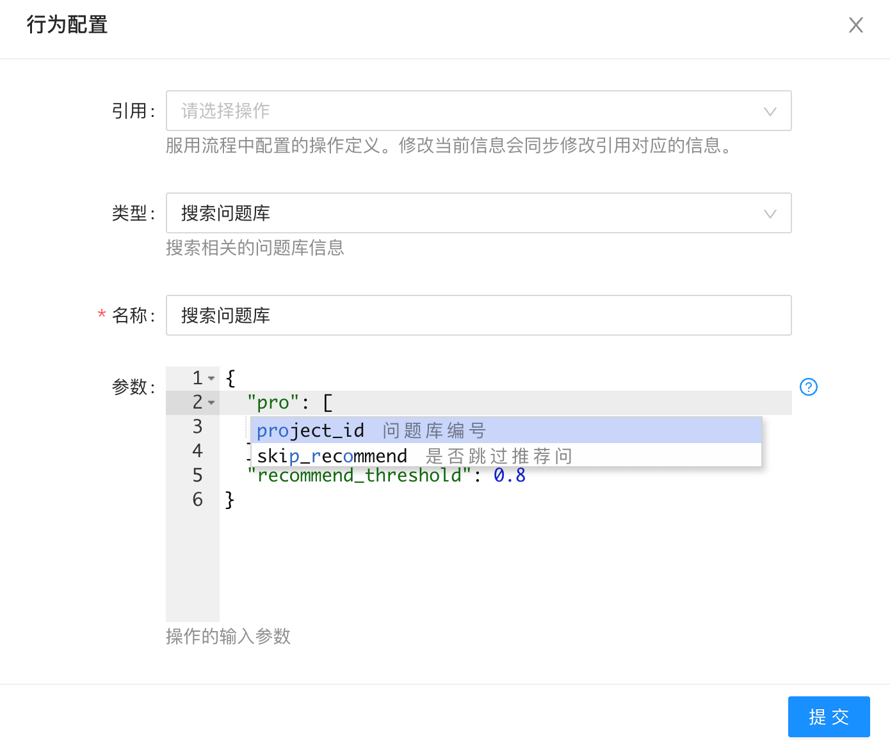

#### 操作类型

| 名称             | 备注                                                               |
| ---------------- | ------------------------------------------------------------------ |
| 搜索问题库       | 搜索相关的问题库信息                                               |
| 创建回复文本     | 自定义回复文本返回                                                 |
| 查询回应 by 意图 | 根据当前的对话人的意图，查询配置回应中对应意图的数据进行消息返回。 |
| 查询回应         | 查询对应的回应信息并返回消息。                                     |
| 询问缺失信息     | 根据缺失槽位返回询问，用于获取流程所需的一些关键槽位信息。         |
| 创建推荐         | 针对文本对话场景下，生成推荐问。                                   |
| 查询实体属性     | 通过提取到的的实体和属性信息查询实体数据。                         |
| 设置电话参数     | 针对电话对话场景使用，设置一些信息来操作电话的反馈。               |
| 发送短信         | 选择指定 sms 厂商，配置对应参数进行短信发送。                      |
| 设置槽位         | 配置当前上下文的槽位，支持 json 格式和表达式。                     |
| 重置会话         | 重置当前的所有上下文槽位到初始化状态。                             |
| 返回节点         | 返回上一个节点或者返回上一个主节点。                               |
| 重复上一次回复   | 回复上一次回复的回复文本。                                         |

### 可用槽位

流程定义：流程全局槽位 /流程初始化槽位；
固定使用：流程跟踪槽位/操作槽位

| 名称             | 类型      | 备注                                         |
| ---------------- | --------- | -------------------------------------------- |
| 是否新消息       | bool      | 当前节点是否是处理消息的第一个节点。         |
| 最后主节点       | str       | 当前会话过程中最后一次停留的主节点。         |
| 接受消息（全）   | list[str] | 会话中接收到的所有客户的文本。               |
| 回复消息（全）   | list[str] | 会话中发送给客户的所有文本。                 |
| 问题库搜索结果   | bool      | 问题库是否返回数据，每次问题库查询重新设置。 |
| 是否超过重复执行 | bool      | 是否有节点操过了重复次数。                   |
| 是否静默         | bool      | 用户是否不说话。                             |
| 静默次数         | int       | 用户连续静默次数。                           |
| 是否打断         | bool      | 是否打断，每次客户回答重新设置。             |
| 打断次数         | int       | 用户连续打断语音播放的次数。                 |
| 语音播放长度     | int       | 客户聆听语音播放的时间长度（秒数）。         |
| 跳过运行         | bool      | 是否跳过下一个节点的执行。                   |

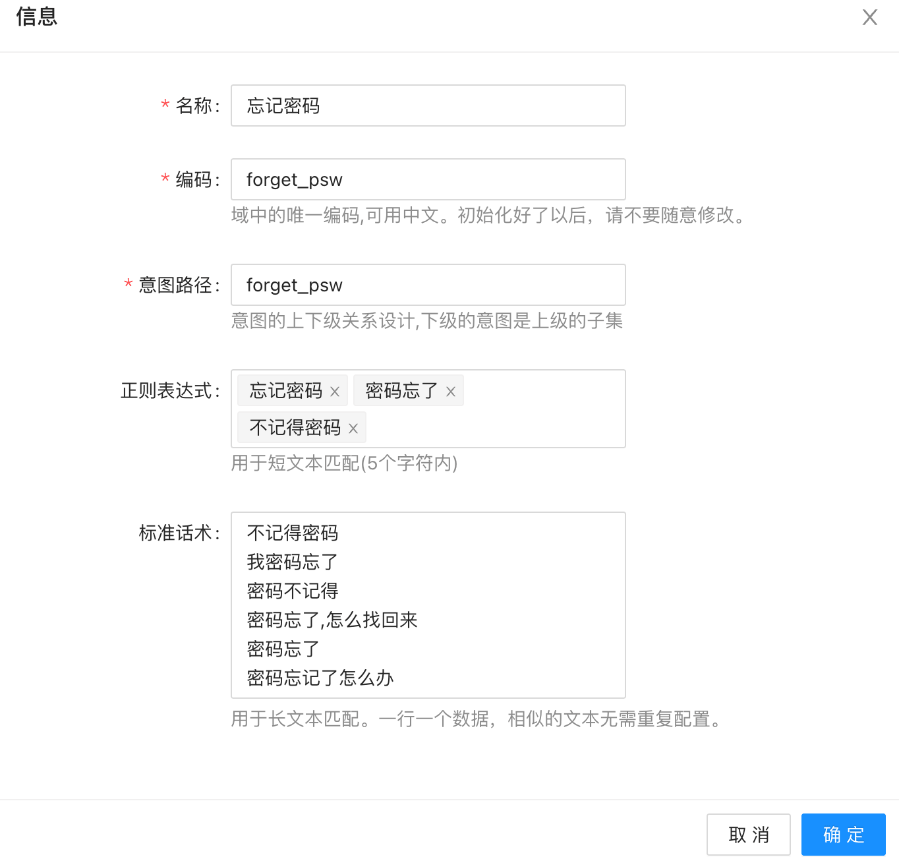

## 流程-忘记密码


### 主流程实现

1. 主流程逻辑实现。
2. 配置意图

    1. 复用已有的意图
    2. 使用回应/回复实现推荐跳转
    3. 配置个性化意图

3. 配置操作
    1. 创建回复文本
    2. 查询回应


### 操作-创建回复-推荐

创建回复文本，使用推荐按钮来辅助指定按钮对应的意图。

```json
{
    "text": "请问您是忘记登录密码还是交易密码?",
    "buttons": [
        {
            "title": "(1)登录密码",
            "payload": "/login_psw"
        },
        {
            "title": "(2)交易密码",
            "payload": "/deal_psw"
        }
    ]
}
```

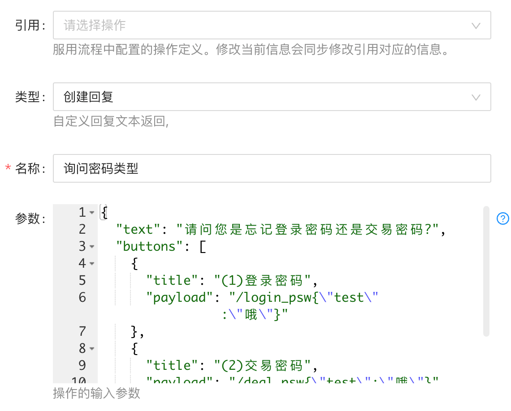

### 全局流程实现

1. 配置兜底处理（连线无需配置条件），一般是搜索对应问题库。
2. 针对可能出现的意图进行配置对应的处理
    1. 一般有（投诉、转人工）等意图的相关操作
    2. 外呼会有（在忙，不是本人）等意图的相关操作
3. 可以考虑统一全局的处理逻辑，配置成子流程进行复用。

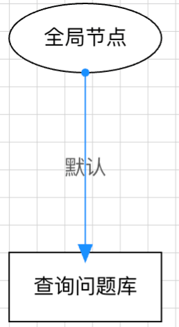

## 调试阶段

当配置好对应的数据以后，我们需要在系统中进行调试，补充数据。

其中包含了：

搜索调试
意图调试
流程调试

### 搜索调试

在 域/操作/测试/搜索 可以发起对问题库的测试

发现有问题，可以通过：

1. 修改：修改匹配问题的信息。
2. 补充：补充当前搜索文本到对应匹配问题。
3. 删除：删除配置的扩展问。

来修正信息，达到你想要的匹配效果。

信息的修改如果是当前域的数据会实时生效。

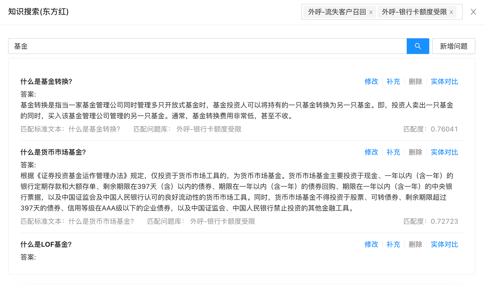

### 意图调试

在 域/操作/测试/意图 可以发起对意图匹配的测试。
发现问题，可以通过：

1. 新增匹配文本。 （会根据新增的文本，自动补充到 正则表达式或者 标准话术）
2. 删除匹配文本。

来修改匹配逻辑，修改当前域的数据也是实时生效。

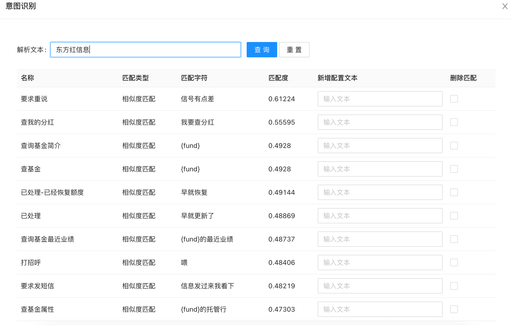

### 流程调试

在 域/话术/操作/对话 可以发起对话术流程的测试。


#### 流程监控

1. 类型： 接受、回复、操作。
2. 文本：接收和回复的文本。点击可进行意图识别结果和搜索结果的查看和修正。
3. 意图：识别到的对话人意图。
4. 槽位：每一步处理后的槽位信息。
5. 行为结果：每一步操作都会有相应的处理结果，往下一个操作进行传输。如果报错可进行查看。

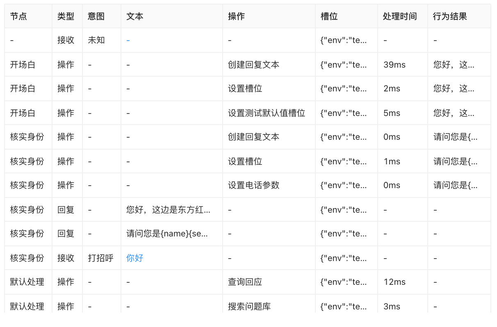

## 常见问题

我们解释一下当前开发中遇到的常见问题。

### 兜底操作和自动执行如何配置？

兜底：所有情况走不通，最后走的线路。
自动执行：在走到某个节点下，需要自动执行下一个节点。。

#### 兜底

其他连线不满足的情况，走当前。
当前节点必须是 消息的第一个处理节点。

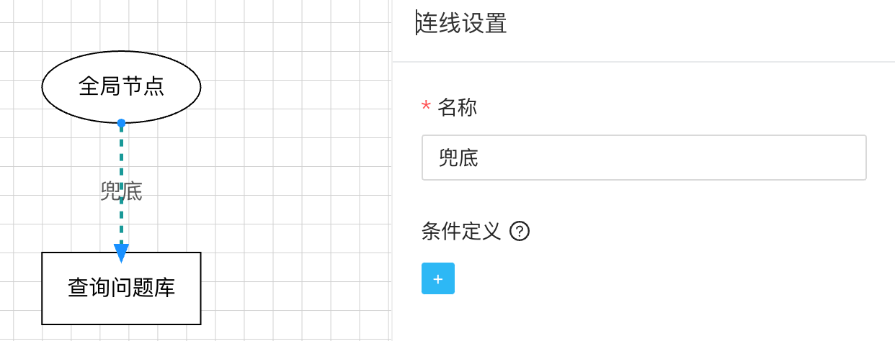

#### 自动执行

表示当前配置，所有情况都满足。


### 如何判断优先级？

1. 主流程连线判断完才会判断全局流程。
2. 条件配置优先级。（配置 98 > 99）
3. 同一个节点下的连线，意图匹配深度越深越优先。（肯定.满意 > 否定）
4. 意图一致情况下，槽位匹配的变量越多越优先。({"new":true,"right":true} > {"new":true})

### 问题搜索匹配度更高，但是不返回？

搜索信息和匹配信息会进行实体信息对比（实体名和实体属性），相关信息必须对应上，才会在对话中返回。
如果出现匹配度比较高，但是对话没有返回的情况，请确认一下是否属于当前情况。


